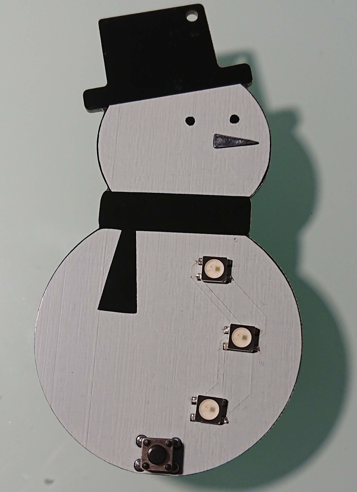
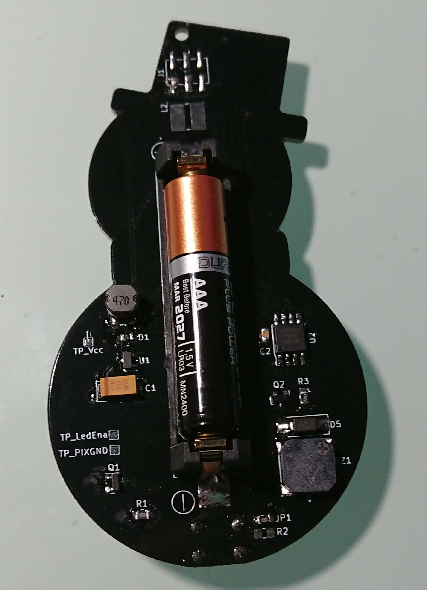

# Simple-Christmas-Ornament
Christmas Ornament

Based on this project:

	- Title:	ESP8266 Christmas Ornaments!
	- Author:	Sean Hodgins
	- Link:		https://www.instructables.com/id/ESP8266-Christmas-Ornaments/

**BOM:**

	- (1) Attiny85
	- (3) WS2812
	- (1) DC/DC Step up converter ME2108
	- (1) Buzzer MLT-8530
	- (1) BC817
	- (1) SI2302
	- (1) Push Button
	- (1) [SMD AAA Batery Holder](https://www.aliexpress.com/item/5Pcs-lot-1-AAA-Battery-Holder-SMD-SMT-High-Quality-Battery-Box-With-Bronze-Pins-TBH/32795495670.html?ws_ab_test=searchweb0_0,searchweb201602_5_10065_10068_10547_319_10891_317_10548_10696_10084_453_454_10083_10618_10307_10820_10821_10301_10303_537_536_10059_10884_10887_321_322_10103,searchweb201603_51,ppcSwitch_0&algo_expid=1f16c75a-10c3-4c96-85c8-67561e371a74-2&algo_pvid=1f16c75a-10c3-4c96-85c8-67561e371a74&transAbTest=ae803_3)
	- (1) Schottky Diode
	- (1) M7 Diode
	- (1) 47uF Capacitor
	- (1) 0.1uF Capacitor 
	- (1) 470 Ohm Resistor
	- (1) 10 kOhm Resistor

**FEATURES:**

	This Ornaments plays a song every time the button is pressed. Leds changes its color to the rhythm of the song.
	Attiny85 goes to deep sleep to save energy.

**PICTURES**

	
